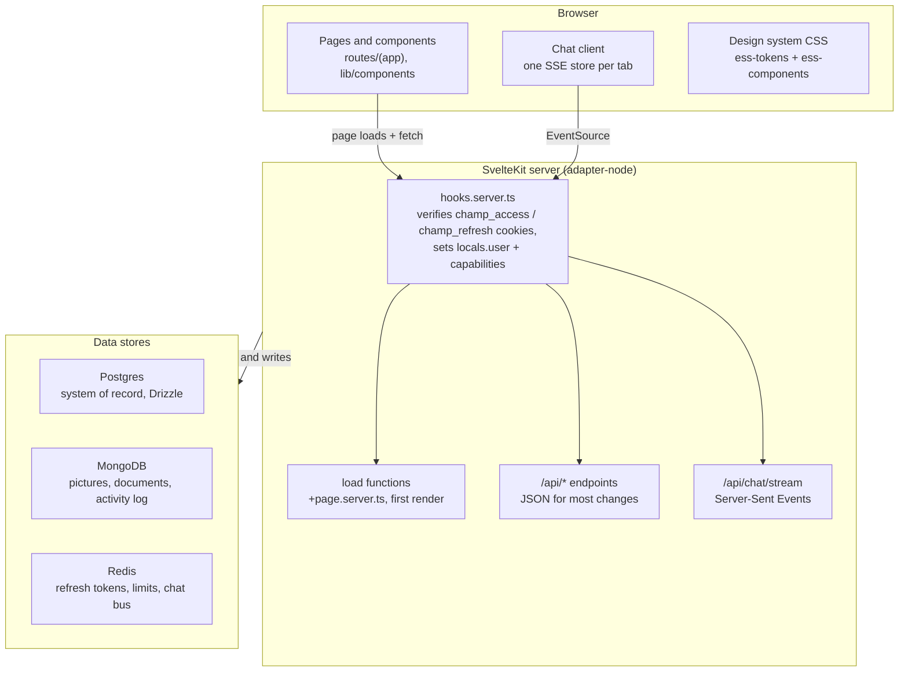

# ESS Portal — Frontend Handoff

As of 2026-10-07

## Overview

Champ HR ESS is a SvelteKit 2 / Svelte 5 employee self-service portal for about 250 Champions/LakeB2B staff, served as one Node app with server-rendered pages and JSON API routes in the same repo. There is no separate frontend codebase: the "frontend" is the `.svelte` routes and components under `src/`, plus the shared CSS design system.

- **Employees** check leave balances, apply for leave, view attendance and payslips, read policies and announcements, chat, and edit their profile. Visits are short, between tasks, on day and night shifts.
- **Team leads, HR admins and the super admin** approve leave and attendance corrections, manage rosters and logins (single or bulk spreadsheet import), publish holiday calendars and leave policies, and run the Admin Controls tools.

The product rule from `PRODUCT.md`: every screen should let someone finish one HR task fast, with numbers they can trust. The repo's `README.md` is still the SvelteKit scaffold boilerplate; `PRODUCT.md` and `docs/` are the real references.

## Getting started

You need Node 20, Postgres, MongoDB and Redis running locally; `docker compose up postgres mongo redis` gives you all three on their default ports.

| Area | Choice |
| --- | --- |
| Framework | SvelteKit 2.63, Svelte 5.56 in runes mode (forced for all project files in `vite.config.ts`) |
| Build | Vite 8, `@sveltejs/adapter-node` (no separate `svelte.config.js`; the adapter is set in the Vite plugin) |
| Language | TypeScript 6, checked with `svelte-check` |
| UI libraries | `@lucide/svelte` icons, `motion` for animation; no component library, no Tailwind |
| Styling | Plain CSS with `--ess-*` tokens in `src/lib/styles/` |
| Tests | Vitest 4, Node environment, `src/**/*.test.ts` only |

1. `npm install`
2. Copy `.env.example` to `.env`. For local frontend work you need `DATABASE_URL`, `MONGO_URL`, `REDIS_URL`, both JWT secrets and the three `SUPER_ADMIN_*` values. ProHance, Resend and EasyTime settings can stay unset; those features no-op or warn.
3. `npm run db:migrate`, then `npm run db:seed` to create the super admin login.
4. `npm run dev` and sign in with the super admin email and password.

Useful scripts: `npm run check` (types), `npm test`, `npm run db:studio` (browse Postgres).

## Architecture

Every request passes `hooks.server.ts` before a page or API route runs.



The frontend and backend ship as one Node process. Server-only code lives in `src/lib/server/` and SvelteKit refuses to bundle it into the browser; shared pure logic (capabilities, leave and attendance rules, admin tabs) sits directly in `src/lib/` so both sides and the tests can import it.

## Screens

The app has 11 signed-in pages plus 9 Admin Controls tabs. Everything under `src/routes/(app)/` shares one layout that sends signed-out users to `/login` and forces `/change-password` when `mustChangePassword` is set.

Access has two layers. A **base role** (`employee`, `team_lead`, `admin` shown as "HR Admin", `super_admin`) decides reporting position. **Capabilities** (`src/lib/capabilities.ts`) decide what someone may do; a Super Admin can bundle them into named roles such as IT Support. Gate UI on capabilities, not on role strings.

| Route | Screen | Who sees it | Notes |
| --- | --- | --- | --- |
| `/login`, `/change-password`, `/logout` | Auth | Everyone | Use `AuthLayout.svelte`, outside the app shell |
| `/dashboard` | Home | Everyone | Stat cards, quick actions, announcements feed (423 lines) |
| `/chat` | Champ Chat | Everyone | Live chat over SSE (`/api/chat/stream`); `/announcements` redirects to `/chat?c=announcements` |
| `/profile` | My Profile | Everyone | Profile fields and avatar upload |
| `/leave`, `/leave/apply` | Leave | Everyone | Balances, `LeaveCalendar`, apply form |
| `/attendance` | Attendance | Everyone | `AttendanceCalendar` (1,227 lines), corrections and comp-off claims |
| `/policies` | Policies | Everyone | Published leave policy and holiday calendar |
| `/hr-contacts` | HR contacts | Everyone | Not in the sidebar; linked from a dashboard card |
| `/payroll` | Payroll | Nobody yet | Sidebar shows it greyed with a "Soon" badge; the route redirects to `/dashboard` |
| `/team` | Team | Team Lead and up | Roster, approvals, person settings; the largest page at 2,166 lines |
| `/admin` | Admin Controls: Overview | Any admin capability | Open issues worked out from live data |
| `/admin/people` | People | `people.*` | Logins, bulk import, rosters, password activity |
| `/admin/biometric` | Biometric | `attendance.biometric_upload` | Manual device-report upload |
| `/admin/leave-balances` | Leave Balances | `leave.set_balances` | Spreadsheet upload of opening balances |
| `/admin/policies` | Policies | `policies.publish` | Publish holiday calendar and leave policy |
| `/admin/org-chart` | Org Chart | `org.view` | Reporting hierarchy |
| `/admin/access-control` | Roles & access | `access.view`, `system.roles` | Named roles and privileges |
| `/admin/cleanup` | Data Cleanup | `system.cleanup` | Super Admin only; deletes are permanent |
| `/admin/tweaks` | Design Tweaks | `system.design_tweaks` | Previews design variants in your own browser only |

To add an admin page, add one entry to `ADMIN_TABS` in `src/lib/admin-tabs.ts`. The tab bar, the Ctrl+K jump list and the access check all read from it.

## Page routes

There are 24 page routes: 18 render a screen, 3 only redirect and 3 handle sign-in and sign-out. The `load` returns column shows what data each screen gets, so you don't need to open its server file. Every `(app)` page also gets the layout fields described under Data & auth.

| Route | Guard | `load` returns | Form actions |
| --- | --- | --- | --- |
| `/` | none | redirects to `/dashboard` or `/login` | |
| `/login` | signed-in users go to `/dashboard` | | none; posts to `/api/auth/login` |
| `/change-password` | signed in, `mustChangePassword` set | `user` | none; posts to `/api/auth/change-password` |
| `/logout` | | | `default`: clears cookies, redirects to `/login` |
| `/dashboard` | signed in | `leaveBalance`, `leaveTypeCount`, `attendancePct`, `attendanceSpark`, `daysWithCheckIn`, `businessDaysSoFar`, `pendingCount`, `approvalQueue`, `upcomingHolidays` | |
| `/chat` | signed in | `me`, `can`, `sidebar`, `feed`, `announcementAdmin`, `now` | `saveAnnouncement`, `takeDown`, `restore`, `remind` (needs `announcements.post`) |
| `/announcements` | | redirects (307) to `/chat?c=announcements` | |
| `/profile` | signed in | `profile`, `userRow`, `managers`, `hasProfilePicture`, `profilePictureVersion` | `updateSelfService` |
| `/leave` | signed in | `allocations`, `monthlyBalances`, `myApplications`, `approvalQueue`, `canApprove`, `decidedQueue`, `canReverseDecisions`, `calendarHolidays`, `leaveEvents`, `weekOffRosters`, `weekOffAssignments`, `myWeekOff` | |
| `/leave/apply` | signed in | `types` (leave types this person may apply for) | none; posts to `/api/leave` |
| `/attendance` | signed in; `?month=` picks the month | `today`, `viewMonth`, `records`, `punchDays`, `monthHolidays`, `monthLeaves`, `monthProhance`, `presentDays`, `avgHours`, `shifts`, `compOffCredits`, `myDeviations`, `deviationMonthlyUsed`/`Cap`, `canReview`, `deviationQueue`, `compOffQueue` and more | |
| `/policies` | signed in | `hasShiftAssignment`, `resolvedCalendar`, `leaveTypes` | |
| `/hr-contacts` | signed in | `contacts` | |
| `/payroll` | | redirects to `/dashboard` (not built) | |
| `/team` | employees without a `people.*` capability go to `/dashboard` | `roster`, `teamSize`, `presentNow`, `onLeave`, `pendingApprovals`, `creatableRoles`, `namedRoles`, eight `can*` flags, `hrPeople`, `shiftGroups`, `weekOffRosters`, `allPeople`, `allTeams`, `bulkImports`, `passwordActivity` and more | `createEmployee`, `uploadBulkImport`, `applyBulkImport`, `resendBulkImportLogins` |
| `/admin` | any admin capability (admin layout) | layout: `adminRole`, `adminCaps`, `adminIssues`, `adminStrips`, `adminIssueCount` | |
| `/admin/people` | `people.*` | same `load` and actions as `/team` (re-exported) | as `/team` |
| `/admin/biometric` | `attendance.biometric_upload` | `recentUploads` | none; uses `/api/admin/biometric-upload` |
| `/admin/leave-balances` | `leave.set_balances` | `year`, `leaveTypes`, `hrSet` | none; uses `/api/admin/leave-balances` |
| `/admin/policies` | `policies.publish` | `shiftGroups`, `publishedCalendars`, `leaveTypes` | none; uses `/api/admin/policy-documents` |
| `/admin/org-chart` | `org.view` | `chart`, `teamNames`, `stats` | |
| `/admin/access-control` | `access.view` or `system.roles` | `canManage`, `viewerId`, `teamRows`, `byRole`, `namedRoles`, `people` | `saveRole`, `deleteRole`, `assign` |
| `/admin/cleanup` | `system.cleanup` | `preview`, `currentUserName` | none; uses `/api/admin/cleanup` |
| `/admin/tweaks` | `system.design_tweaks` | nothing; client-only previews | |

Admin pages call `gateAdminPage(locals, [caps])` from `src/lib/server/capabilities.ts` at the top of `load`. Copy that line into any new admin page.

## API routes

There are 45 `+server.ts` endpoints under `src/routes/api/`. All of them check the session themselves: "signed in" means `requireUser` or `locals.user`, and a capability means `requireCap`. Two endpoints, `/api/chat/[...path]` and `/api/champ/[...path]`, each handle many sub-paths behind one file.

**Auth and self-service**

| Endpoint | Methods | Who | Purpose |
| --- | --- | --- | --- |
| `/api/auth/login` | POST | anyone | Sign in; sets `champ_access` and `champ_refresh` cookies |
| `/api/auth/logout` | POST | anyone | Clear the session |
| `/api/auth/change-password` | POST | signed in | Change own password (also the forced first-login change) |
| `/api/profile` | GET | signed in | Own profile as JSON |
| `/api/profile-picture` | POST, DELETE | signed in | Upload or remove own avatar (stored in Mongo) |
| `/api/profile-picture/[userId]` | GET | signed in | Serve anyone's avatar |
| `/api/users` | GET, POST | Team Lead, HR Admin, Super Admin | List people / create a login (Team Leads only for their own team) |

**Leave and attendance**

| Endpoint | Methods | Who | Purpose |
| --- | --- | --- | --- |
| `/api/leave` | GET, POST | signed in | List own applications / apply for leave |
| `/api/leave/[id]/approve` | POST | approver in the chain | Approve or reject; used by `/leave`, `/dashboard` and chat cards |
| `/api/attendance/deviations` | GET, POST | signed in | List / raise an attendance correction (AI triage via OpenRouter) |
| `/api/attendance/deviations/[id]/review` | POST | reporting manager or HR | Decide a correction (two-stage, SOP §2–§4) |
| `/api/attendance/comp-off` | GET, POST | signed in | List / claim comp-off |
| `/api/attendance/comp-off/[id]` | DELETE | claimant | Withdraw own claim |
| `/api/attendance/comp-off/[id]/review` | POST | reviewer | Verify 7+ hours and credit comp-off (SOP §1) |
| `/api/attendance/easytime-import` | POST | device import token (Bearer) | Scheduled EasyTime Pro export; not called by the UI |

**Announcements**

| Endpoint | Methods | Who | Purpose |
| --- | --- | --- | --- |
| `/api/announcements/[id]` | POST | signed in | Record opened, confirmed or dismissed |
| `/api/announcements/[id]/attachment` | GET | signed in | Download the attachment |
| `/api/announcements/[id]/calendar` | GET | signed in | `.ics` file for an event post |
| `/api/announcements/read-all` | POST | signed in | Mark all read |
| `/api/admin/announcements/[id]/pending` | GET | `announcements.post` | Who hasn't read or confirmed yet |

**Admin**

| Endpoint | Methods | Capability | Purpose |
| --- | --- | --- | --- |
| `/api/admin/users/[id]` | DELETE | `people.delete` | Permanently delete a person and their records |
| `/api/admin/users/[id]/password` | PUT | `people.reset_password` | Issue a temporary password |
| `/api/admin/users/[id]/settings` | PUT | `people.edit_settings` (role changes need `people.assign_roles`) | Role, reports-to, concerned HR, shift, timings, week off in one call |
| `/api/admin/users/[id]/employee-code` | PUT | `people.employee_code` | Set the code that links biometric punches |
| `/api/admin/users/[id]/pink-leave` | PUT | `people.edit_settings` | Override pink-leave eligibility |
| `/api/admin/bulk-imports/[id]` | GET | `people.bulk_import` | Bulk import status and rows |
| `/api/admin/bulk-imports/[id]/rows/[rowId]` | PATCH | `people.bulk_import` | Fix one row before applying |
| `/api/admin/week-off-rosters` | GET, POST | `leave.week_off_rosters` | List / create rosters |
| `/api/admin/week-off-rosters/[id]` | PUT, DELETE | `leave.week_off_rosters` | Edit / delete (refused while assigned) |
| `/api/admin/week-off-rosters/[id]/publish` | POST, DELETE | `leave.week_off_rosters` | Publish / unpublish for team managers |
| `/api/admin/biometric-upload` | POST | `attendance.biometric_upload` | Preview a device report |
| `/api/admin/biometric-upload/apply` | POST | `attendance.biometric_upload` | Apply the previewed report |
| `/api/admin/prohance-sync` | GET, POST | `attendance.device_sync` | Poller status / run a sync now |
| `/api/admin/leave-balances` | POST | `leave.set_balances` | Preview a balance spreadsheet |
| `/api/admin/leave-balances/apply` | POST | `leave.set_balances` | Apply it |
| `/api/admin/leave-types/[id]` | PATCH, DELETE | `policies.publish` | Edit / permanently delete a leave type |
| `/api/admin/leave-types/[id]/archive` | POST | `policies.publish` | Archive a leave type |
| `/api/admin/policy-documents` | POST | `policies.publish` | Upload a holiday calendar or leave policy (image/PDF) for AI extraction |
| `/api/admin/policy-documents/[id]/publish-holiday-calendar` | POST | `policies.publish` | Publish the reviewed calendar |
| `/api/admin/policy-documents/[id]/publish-leave-policy` | POST | `policies.publish` | Publish the reviewed policy |
| `/api/admin/holiday-calendars/[id]/archive` | POST | `policies.publish` | Archive a calendar |
| `/api/admin/cleanup` | POST | `system.cleanup` | Opt-in bulk reset of seeded/test data |

**Chat and Champ**

| Endpoint | Methods | Who | Sub-paths |
| --- | --- | --- | --- |
| `/api/chat/stream` | GET | signed in | Server-Sent Events for one tab |
| `/api/chat/[...path]` | GET, POST, PATCH, DELETE | signed in; `export` needs `chat.export` | `sidebar`, `people`, `browse`, `saved`, `search`, `messages`, `presence`, `push-key`, `prefs`, `reports`, `files`, `channels/…` (`members`, `pinned`, `todos`, `thread`, `export`, `join`, `leave`, `mute`, `read`, `typing`), `msg/…` (`react`, `pin`, `save`, `report`, `vote`, `hide`), `dm`, `groups`, `desk`, `push` |
| `/api/champ/[...path]` | GET, POST | signed in | GET `tasks`, `status`, `approvals`; POST `ask`, `apply`, `tasks/[id]` |

## Design system

The visual language is "Cosmic": glass cards over a starfield, with numbers as the main focus. All styling goes through two global CSS files that `src/app.css` imports. There is no Tailwind and no component library.

| File | What it holds | Size |
| --- | --- | --- |
| `src/lib/styles/ess-tokens.css` | `--ess-*` custom properties: glass recipes, colour ramps, type scale, spacing, elevation, motion | 302 lines |
| `src/lib/styles/ess-components.css` | Global `.ess-*` classes: `ess-btn`, `ess-card`, `ess-table-shell`, `ess-badge--{approved,pending,...}`, `ess-modal`, `ess-drawer`, `ess-tabs`, `ess-toast`, `ess-skeleton`, `ess-timeline` and more | 1,417 lines |
| `src/lib/components/*.svelte` | 17 shared components (`StatCard`, `StepTracker`, `LeaveCalendar`, `AttendanceCalendar`, `PersonSettingsPanel`...) plus `announcements/`, `chat/` and `champ/` subfolders | |
| `src/lib/motion.ts` | Slide-over and modal transitions on Motion that wait for exit before releasing the scroll lock; respects `prefers-reduced-motion` | |

Rules to keep:

- **Tokens only.** No hardcoded colours in `.svelte` files. 18 files still have some, mostly `SidebarNav.svelte` (12) and `StatCard.svelte` (9).
- **Theme switch.** Default `<html>` is the light palette (Opal); `data-ess-theme="dark"` switches to Onyx. The `essTheme` and `essShell` (collapsed rail) localStorage keys are applied by an inline script in `src/app.html` before first paint, so there is no flash.
- **Legacy names are aliases.** `--ess-teal-*`, `--ess-green-*` and `--ess-n-*` survive from the earlier teal theme but now map to Cosmic colours. Prefer the semantic tokens in new code.
- **Keep task screens calm.** The visual effects belong in backgrounds and stat displays, not in tables and forms. Body text needs at least 4.5:1 contrast on glass, and focus rings are 3px in the accent colour.

Reference specs: `ESS portal design system/ESS Design System.dc.html` (spec) and `ESS Portal Screens.dc.html` (8 screen mock-ups mapped to their route files in `github.md`); `ESS portal design system (6)/export/` has the Cosmic mock-up and `ESS_Cosmic_Design_Tokens.md`.

## Shared components

Only `Avatar` and `IconChip` are used widely. Most components serve one screen and were pulled out to keep page files a manageable size, so check the Used by column before changing one.

| Component | Lines | Key props | Used by | What it does |
| --- | --- | --- | --- | --- |
| `SidebarNav` | 780 | `activePath`, `role`, `adminIssueCount`, `chatBadge` | `(app)` layout | Nav rail with Me/Manage groups, light/dark toggle, collapse to rail |
| `Avatar` | 82 | `userId`, `fullName`, `hasPicture`, `size`, `version` | dashboard, team, chat, settings panel, nav | Profile photo; falls back to initials if the image fails |
| `AvatarUpload` | 222 | `userId`, `hasPicture`, `pictureVersion` | profile | Upload or remove your own photo, with optimistic update |
| `AuthLayout` | 185 | `headline`, `subtext`, `cardTitle` | login, change-password | Shell for signed-out screens |
| `IconChip` | 38 | `icon`, `size`, `shape`, `background`, `color` | dashboard, hr-contacts, StatCard, QuickActionRow | Lucide icon in a tinted chip |
| `StatCard` | 134 | `icon`, `label`, `value`, `meta`, `spark`, `accent` | dashboard | Headline number with optional sparkline (0–100 bar heights) |
| `QuickActionRow` | 107 | `icon`, `label`, `href`, `onclick`, `soon`, `count`, `urgent` | dashboard | Shortcut row with badge; `soon` makes it inert |
| `ProfileCard` | 47 | `icon`, `title` + children | profile | Titled glass section |
| `StepTracker` | 28 | `steps`, `currentIndex` | leave | Approval progress for an application |
| `LeaveCalendar` | 692 | | leave | Month view of leave, holidays and the week off from the assigned roster |
| `AttendanceCalendar` | 1,227 | | attendance | Month of punches already paired into shifts (handles overnight shifts) |
| `DeviationRequest` | 405 | `initialDate`, `monthlyUsed`, `monthlyCap` | attendance | Raise an attendance correction; explains why the button is disabled |
| `CompOffClaim` | 425 | `credits` | attendance | Claim comp-off; expired credits are not spendable |
| `SopReviewQueue` | 472 | | attendance | Manager/HR queue for corrections and comp-off claims |
| `PersonSettingsPanel` | 533 | `person`, `people`, `shiftGroups`, `rosters`, `roles`, `canEditRole` | team | Every org setting for one person, saved in one call to `/api/admin/users/[id]/settings` |
| `SummaryStrip` | 77 | | admin layout | The three or four headline figures each admin tab opens with |
| `UploadSteps` | 82 | | admin biometric, leave-balances, policies | Same three steps on every admin upload: choose, review, apply |

Feature folders: `chat/` (10 components: `ChatSidebar`, `MessageList`, `MessageItem`, `Composer`, `ThreadPanel`, `InfoPanel`, `FindPanel`, `NewChatDialog`, `ChatPrefs`, `EssCard` for approval cards inside messages), `announcements/` (6, the #announcements feed and its admin view) and `champ/ChampPanel`. All of these are used only by `/chat`.

## Data & auth

Pages get data three ways: SvelteKit `load` functions for the first render, `fetch` calls to `/api/*` JSON endpoints for most changes, and one Server-Sent Events stream for live chat. Only 6 routes use form `actions`, so most mutations follow a `fetch` then `invalidateAll()` pattern rather than progressive enhancement.

- **Session.** `hooks.server.ts` reads two httpOnly cookies, `champ_access` (JWT, 15 minutes) and `champ_refresh` (7 days, rotated and stored server-side). It puts `locals.user` on every request with the user's capabilities attached. The browser never sees a token, so client code has nothing to manage.
- **What every page gets.** The `(app)` layout returns `user` (id, role, fullName, teamId, capabilities, customRoleName), `hasProfilePicture`, `adminIssueCount`, `announcementBadge` and `chatBadge`. Read these from `page.data` instead of fetching them again.
- **Enforcement is server-side.** Client checks on role or capability only hide controls. Every `/api` and `load` guard throws 401/403 or redirects on its own, so a hidden button is never the security boundary.
- **Live chat.** `src/lib/chat/client.svelte.ts` is a single runes-based store started once per tab by the layout. It holds the sidebar and unread counts, listens to `/api/chat/stream`, and re-syncs after a reconnect. Components subscribe to its events rather than opening their own connections. `static/chat-sw.js` handles web push (VAPID keys).
- **Champ assistant.** `/api/champ/*` runs a tool-calling loop via OpenRouter, limited to 6 steps per question and an hourly cap per person.
- **Stores.** Postgres (Drizzle schema in `src/lib/server/db/schema.ts`) is the system of record. Mongo holds profile pictures, documents and the activity log. Redis holds refresh tokens, rate limits and the chat bus.

Routes and permissions are mapped in full, from the source, in `docs/functionality-map.md`; read it before you change any `/api` endpoint.

## Page anatomy

A screen is a `+page.server.ts` that loads everything it needs in one go, plus a `+page.svelte` written with Svelte 5 runes. Nothing in `src/` uses `export let` or `svelte/store`; keep it that way.

1. **Load on the server.** `load` reads `locals.user`, gates on a capability if needed, queries Drizzle and returns plain objects. The server works out who may act, for example `canApprove` and `canReverseDecisions` on `/leave`, so the page never decides from `role` alone.
2. **Read with runes.** `let { data } = $props()`, then `$derived` for anything computed from `data`. Reading `data.x` straight into a `const` captures only the first value; that is what the 34 `svelte-check` warnings are about.
3. **Local UI state** (tabs, confirm steps, in-flight ids) lives in `$state` inside the page.
4. **Mutate with `fetch`** to `/api/*`, show the server's `message` on failure, then refresh. 9 files use `invalidateAll()`; 4 pages still call `location.reload()` and 2 places use `alert()`. Use `invalidateAll()` and an inline error in new code.
5. **Forms** with `use:enhance` are used only on `/profile`, `/admin/access-control`, `/team` and the announcement editor.

```ts
// +page.svelte, the shape new screens should follow
import { invalidateAll } from '$app/navigation';

let { data } = $props();
const canApprove = $derived(data.canApprove);
let busyId = $state<string | null>(null);
let error = $state('');

async function decide(id: string, decision: 'approve' | 'reject') {
  busyId = id; error = '';
  try {
    const res = await fetch(`/api/leave/${id}/approve`, {
      method: 'POST',
      headers: { 'Content-Type': 'application/json' },
      body: JSON.stringify({ decision })
    });
    if (!res.ok) error = (await res.json().catch(() => ({}))).message ?? 'Could not process this request';
    else await invalidateAll();
  } finally { busyId = null; }
}
```

Page-specific CSS goes in the component's own `<style>` block using `var(--ess-*)` tokens; reach for the global `.ess-*` classes first.

## Shared logic in src/lib

HR rules that both the server and the screens need live as pure TypeScript modules in `src/lib/`. Import from these rather than recomputing dates, balances or permissions in a component. Modules marked tested have a `*.test.ts` file next to them.

| Module | Tested | What it decides |
| --- | --- | --- |
| `capabilities.ts` | yes | Capability catalogue, role defaults, `canOpenAdmin`, role labels |
| `admin-tabs.ts` | | The Admin Controls tab list; adding a tab here wires the tab bar, Ctrl+K list and gate |
| `admin-issues.ts` | yes | What Admin Controls flags as needing attention |
| `attendance-cycle.ts` | yes | Attendance runs on a payroll cycle, the 26th to the 25th, named for the month it ends |
| `attendance-markers.ts` | yes | Day markers on the attendance calendar |
| `shift-hours.ts` | | Pairs punches into shifts (including overnight) and computes hours worked |
| `week-off.ts` | yes | Week-off roster patterns: which days a person is off |
| `financial-year.ts` | | Indian financial year, 1 April to 31 March |
| `tenure.ts` | | Length of service from the joining date |
| `chief.ts` | yes | "Chief" is a position at the top of reporting, not an account |
| `org-chart.ts` | yes | Builds the reporting tree from flat user rows |
| `announcements.ts` | yes | Where an announcement shows for one person and when it clears |
| `workplace-policies.ts` | | Company-wide policy text shown on `/policies` |
| `scroll-lock.ts` | yes | Holds the page still under an open overlay (used with `motion.ts`) |
| `champ.ts` | | Types for Champ responses, shared by server and panel |
| `chat/client.svelte.ts` | | The live chat store (see Data & auth) |
| `chat/format.ts` | | Message text to safe HTML; chat timestamps |
| `chat/rules.ts` | yes | Office hours and quiet hours for chat notifications |

The attendance cycle and financial year are easy to get wrong. A screen that shows "this month" for attendance means the cycle ending this month, not the calendar month.

## Testing, build & deploy

On 2026-10-07, against `main` at `09b5538`, all 409 tests passed in 23 files and `svelte-check` reported 0 errors and 34 warnings in 6 files. Most warnings are `state_referenced_locally` (reading `data` once instead of through `$derived`, for example in `profile/+page.svelte`). Fix these when you touch those files.

- **Tests cover logic only.** Vitest runs pure modules in a Node environment. The SvelteKit plugin is left out on purpose, and `$env/dynamic/private` is mocked. There are no component tests and no end-to-end or browser tests, so check UI changes by hand in both themes and with the rail collapsed.
- **Build.** `npm run build` outputs a Node server to `build/`. The Dockerfile is a two-stage Node 20 image listening on port 3000.
- **Deploy.** Railway builds from the Dockerfile and health-checks `/login`. On boot, `start.sh` runs Drizzle migrations, removes old placeholder accounts, seeds the super admin if missing, then starts the server. In production `ORIGIN` must match the public URL exactly, or form posts fail the CSRF check.
- **No CI.** There is no `.github/` workflow, so tests and type checks only run when someone runs them.

## Open questions and gaps

These came up while reading the code; none of them block local work.

- [ ] **Admin nav doesn't match admin access.** `SidebarNav.svelte` shows Admin Controls only for the `admin` and `super_admin` roles, while `/admin` lets in anyone with an admin capability. Someone with the IT Support or Operations role (base role `employee`) can open `/admin` but has no sidebar link to it. Should the sidebar use `canOpenAdmin(capabilities)`?
- [ ] **Payroll scope.** It is in the nav as "Soon" with no design or data model. Who owns it, and is it in the next milestone?
- [ ] **`.env.example` is missing variables the code reads:** `OPENROUTER_API_KEY`, `OPENROUTER_MODEL`, `VAPID_PUBLIC_KEY` and `VAPID_PRIVATE_KEY`. The code also reads both `PROHANCE_API_KEY` and `Prohance_API_KEY`.
- [ ] **Docs have drifted from the code.** `PRODUCT.md` points to `ESS portal design system (4)/`, which isn't in the repo, and says the default palette is Nebula, but the tokens default to light Opal. `docs/functionality-map.md` says only the Super Admin can set employee codes, but HR Admins have `people.employee_code` by default. Which is right?
- [ ] **Which design-system folder is canonical?** Choose between `ESS portal design system/` (spec plus screens) and `ESS portal design system (6)/export/` (Cosmic), and remove or archive the other.
- [ ] **Large files.** `team/+page.svelte` (2,166 lines) and `AttendanceCalendar.svelte` (1,227) are worth splitting before major feature work.
- [ ] **No UI test coverage or CI.** Consider Playwright smoke tests for login, applying for leave and approving it, run on each push.
- [ ] **`README.md` is still the scaffold boilerplate.** Replace it with a short version of the Getting started section above.
